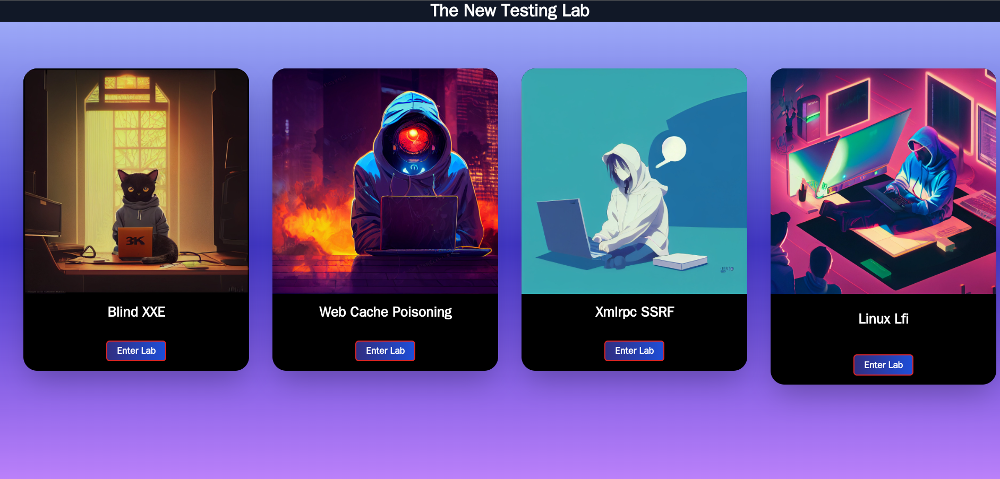

# A New Testing Lab Intro

A simple sample for a lab (~~maybe can be a framework for lab in the future~~)

## Tech

- Frontend: angularjs & tailwind css

- Backend: php

- deploy: docker

## Docker

```shell
docker build -t lab-app .
```


## Show

Home



blind xxe


Linux local file include


Web Cache Poisoning

(仅用于测试,我想现实中的缓存投毒的demo不是这样的)


